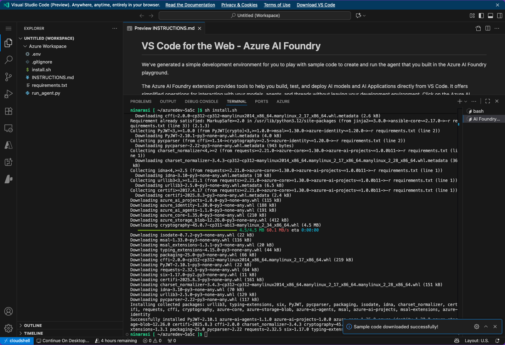

# 1.2 Validate Infrastructure

## 1. Test Container App

Click on the **Endpoint** URL provided in the output - or visit the Azure Portal and look for the Azure Container Apps resource and click the _Application Url_. You should see an agent application like this:

🌟 | Try asking a question like `Tell me about camping tents` - and see what happens.

## 2. Visit Agent Dashboard

Click the `Build & deploy agents with Azure AI Foundry` link (bottom left) to navigate to the underlying Agent on the Azure AI Foundry portal. You should see something like this:

🌟 | Select the agent name to see its details. Explore the integrated tools (Knowledge & Actions). Update the Agent description and instructions.
- Agent name is helpful identification. _Change from "agent-template-assistant" to "cora-for-zava"_. Note how the changes are automatically saved. However, the container app will need to be updated separately.
- Description is for human users. It does not affect agent behavior. Example: _Cora is a customer support agent for the Zava retail enterprise. Cora helps DIY enthusiasts find and purchase home improvement products in Zava stores._
- Instructions are for agents. They guide agent actions. Example: _Use AI Search always. Avoid to use base knowledge._ - we'll modify this later.

Click **Try in playground** to activate the agent for interactive exploration. 
- See how changes made to description or instructions here are _automatically saved_ so they will be visible to agent detailed view in earlier dashboard.
- Try asking [a sample question](https://github.com/Azure-Samples/get-started-with-ai-agents/blob/main/docs/sample_questions.md) like _What's the best tent under $200 for two people, and what features does it include?_ 🚨 - fix Azure AI Search. It is not grounded.

Click the **View Run Info** button. 
- Note how this opens up a view into the traces for agent execution
- Explore the waterfall diagram - see how each step provides token counts & time
- Click on a _Run step_ and a _Tool_ item - how is the output different?
- Click the _Evaluations_ tab - what does it tell us about quality & safety?

- Close the tracing view - can you see the same token counts and latency metrics in the main view?
- Hover over one of the numbers e.g., tokens - see the breakdown in token costs

