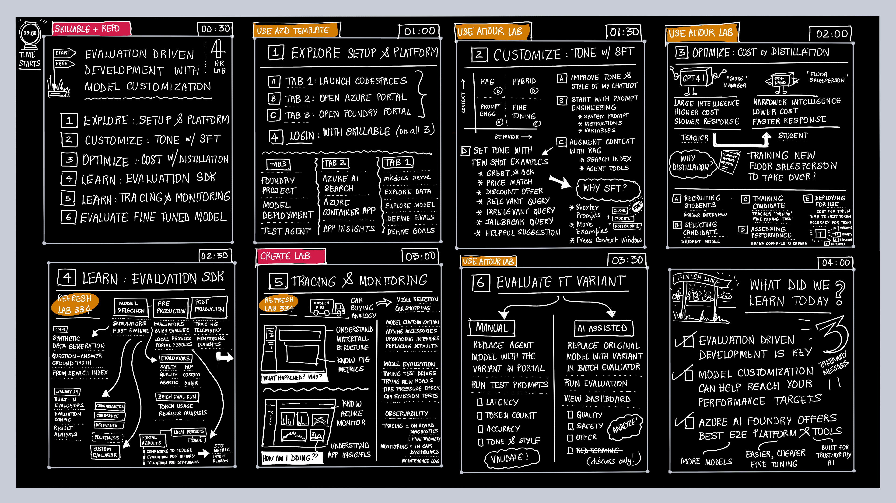

# Learn How To Observe, Manage, and Scale, Agentic AI Apps Using Azure

!!! info "ABSTRACT"

    This hands-on workshop will provide participants with the skills to effectively manage, govern, and scale agentic AI applications using Azure and Azure AI Foundry. The session will cover observability capabilities, model management policies, agent functionalities, and governance strategies. Participants will engage in practical exercises to apply these concepts in real-world scenarios.

    **Level:** 300-400  
    **Duration:** 4 hours

---

## 1. Before You Begin

Before we dive into the workshop, here are two actions you should take:

!!! info "1. STAR THE REPO & WATCH FOR UPDATES"

On completing this workshop, you will walk away with a **personal copy** of the repo that you can use as a sandbox for self-guided exploration. We expect to continue updating this with new labs and resources. Click below to star the repo and watch for updates.

<a class="github-button" href="https://github.com/microsoft/ignite25-PDY123-learn-how-to-observe-manage-and-scale-agentic-ai-apps-using-azure/" data-color-scheme="no-preference: light; light: light; dark: dark;" data-size="large" data-show-count="true" aria-label="Star microsoft/ignite25-PDY123-learn-how-to-observe-manage-and-scale-agentic-ai-apps-using-azure/ on GitHub"> Star This Repo </a>

!!! info "2. PICK YOUR TAB"

The workshop is setup for use by both instructor-led (in-venue) and self-guided (at-home) learners. Select the tab that represents your current status, to get the related instructions. _This preference is automatically enforced sitewide_,

=== "Instructor-Led (In Venue)"

    !!! success "I am at a Microsoft Ignite Session · I'll use the provided Azure subscription."

=== "Self-Guided (At Home)"

    !!! quote "I am working through the lab at home · I'll use my own Azure subscription."

---

## 2. About The Workshop

This is a 4-hour workshop that is broken up into smaller labs that should be completed in order. 

The workshop is organized into two tracks: **Core Labs** that cover the learning objectives outlined below, and **More Labs** that provide additional content for exploration if time permits. _You are encouraged to revisit the More Labs section in self-guided mode, at home_.

!!! quote "PLANNING ROADMAP FOR CORE LABS"

    

### 2.1 What are we building?

Zava is an enterprise retail store that specializes in home improvement goods for DIY enthusiasts. You are an AI engineer tasked with building **Cora**, the new customer support AI chatbot for Zava customers. 

To unlock business value, Zava sets three requirements:

1. **Be Polite & Helpful** - Cora must respond with a desired tone & style.
1. **Be Cost-Effective** - Cora should be fast to respond and cheap to operate
1. **Be Safe & Reliable** - Cora has end-to-end observability for trustworthy AI operation

In this workshop, we'll see how we can start from a basic AI Agent template - and iteratively refine model context and behavior till we get the desired _Cora AI_ experience.

### 2.2 What will we learn?

By the end of this session, you will be able to

- Build and deploy an agentic AI retail chatbot on Azure AI Foundry
- Evaluate the quality, safety & agentic efficacy of chatbot operation
- Fine-Tune the chatbot model to customize tone & style of response
- Distill chatbot behavior to a smaller model for cost-effective operation
- Trace and monitor chatbot operations to detect & debug performance issues
- Understand how Azure AI Foundry enables end-to-end observability for AI 

### 2.3 Check Pre-Requisites!

=== "Instructor-Led (In Venue)"

    To be effective in this workshop, you will need:

    - [ ] A personal GitHub Account. Sign up [for a free account](https://github.com/signup) if needed.
    - [ ] Familiarity with Visual Studio Code and Python. This is a hands-on lab.

    We will provide the following: 

    - [X] Powered laptops setup with the labs for your use.
    - [X] An Azure subscription with pre-provisioned resources.

=== "Self-Guided (At Home)"

    To be effective in this workshop, you will need:

    - [ ] A personal GitHub Account. Sign up [for a free account](https://github.com/signup) if needed.
    - [ ] Familiarity with Visual Studio Code and Python. This is a hands-on lab.
    - [ ] Your own laptop. Make sure it is fully-charged for a 4-hr session.
    - [ ] Your own Azure subscription. We'll help you provision the project!

## 3. Let's Get Started 🚀

Click the _Next_ button below - or click on [Core Labs](./Core-Labs/1-Get-Started/01/) in the navigation menu!

